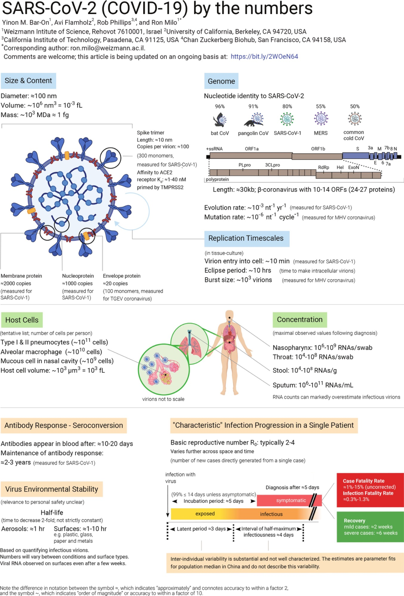

```{r setup, include=FALSE}
library(knitr)
```

---

# Introducción: ¿Por qué necesitamos la notación científica en microbiología?

Imagina que intentas describir el diámetro del virus SARS-CoV-2 escribiendo todos sus ceros:

$$0.000{,}000{,}100 \text{ metros}$$

¡Eso es difícil de leer, difícil de comparar y muy fácil de equivocarse! Por eso los científicos usamos la **notación científica**, que nos permite expresar números muy grandes o muy pequeños de forma compacta y clara.

::: {.callout-note}
## 📌 Recuerda
La **notación científica** escribe cualquier número en la forma:

$$a \times 10^n$$

donde $1 \leq a < 10$ y $n$ es un número entero (positivo o negativo).
:::

En esta guía usaremos datos **reales** del SARS-CoV-2 (el virus que causa el COVID-19) para practicar estas habilidades matemáticas.

---

# La infografía científica como fuente de datos

El siguiente diagrama fue publicado por investigadores del Instituto Weizmann de Ciencias (Israel) y el Caltech. Contiene docenas de valores numéricos reales sobre el SARS-CoV-2.

{#fig-infografia fig-alt="Infografía científica del SARS-CoV-2" width="100%"}

::: {.callout-tip}
## 🔍 Observa la imagen
Tómate 2 minutos para explorar la infografía. Fíjate en cuántos números aparecen y en qué **unidades** están expresados. Verás: **nm**, **nm³**, **fL**, **MDa**, **fg**, **kb**, entre otros.
:::

---

# Unidades de medida en microbiología

Antes de trabajar con los números del virus, necesitamos conocer las unidades que usan los microbiólogos.

## El Sistema Internacional y los prefijos

Todo parte del **metro (m)** para longitud, el **gramo (g)** para masa y el **litro (L)** para volumen.

| Prefijo | Símbolo | Factor | Notación científica | Ejemplo biológico |
|---------|---------|--------|---------------------|-------------------|
| Mega | M | 1,000,000 | $10^6$ | Tamaño del genoma humano (~3,000 Mb) |
| Kilo | k | 1,000 | $10^3$ | Longitud de un cromosoma bacteriano |
| — | — | 1 | $10^0$ | 1 metro |
| Mili | m | 0.001 | $10^{-3}$ | Grosor de un cabello humano (~70 µm) |
| **Micro** | **µ** | **0.000001** | $10^{-6}$ | **Diámetro de una bacteria (~1–10 µm)** |
| **Nano** | **n** | **0.000000001** | $10^{-9}$ | **Diámetro de un virus (~100 nm)** |
| **Femto** | **f** | $10^{-15}$ | $10^{-15}$ | **Volumen de una bacteria (~1 fL)** |

: Prefijos del SI más usados en microbiología {#tbl-prefijos}

## Unidades especiales en biología molecular

| Unidad | Símbolo | Equivalencia | Se usa para |
|--------|---------|-------------|-------------|
| Dalton | Da | masa de 1 átomo de hidrógeno ≈ $1.66 \times 10^{-24}$ g | masa de moléculas |
| **Mega**dalton | MDa | $10^6$ Da | masa de virus, proteínas grandes |
| Kilobases | kb | $10^3$ pares de bases de ADN/ARN | tamaño del genoma |
| Femtolitro | fL | $10^{-15}$ L | volumen de células y virus |

: Unidades especiales en biología molecular {#tbl-unidades-bio}

---

# Notación científica: teoría y ejemplos resueltos

## Conversión de número decimal a notación científica

**Regla:** Mueve el punto decimal hasta que quede un solo dígito antes del punto. El exponente de 10 indica cuántos lugares y en qué dirección moviéste el punto.

- Si el número original es **mayor que 10** → el exponente es **positivo**
- Si el número original es **menor que 1** → el exponente es **negativo**

## Ejemplo resuelto 1: Diámetro del SARS-CoV-2

De la infografía: el **diámetro del SARS-CoV-2 es ≈100 nm**.

Convirtamos 100 nm a metros:

**Paso 1:** Convertir nm a metros.
Sabemos que $1 \text{ nm} = 10^{-9} \text{ m}$

$$100 \text{ nm} = 100 \times 10^{-9} \text{ m}$$

**Paso 2:** Escribir en notación científica correcta (un solo dígito antes del punto):

$$100 \times 10^{-9} = 1.00 \times 10^{2} \times 10^{-9} = 1.00 \times 10^{-7} \text{ m}$$

::: {.callout-important}
## ✅ Resultado
$$\text{Diámetro del SARS-CoV-2} = 1.00 \times 10^{-7} \text{ m}$$

Es decir, **una décima millonésima de metro**. Para ponerlo en perspectiva: ¡caben 1,000 viriones SARS-CoV-2 en el diámetro de un cabello humano (~100 µm)!
:::

## Ejemplo resuelto 2: Masa del virión

De la infografía: **masa ≈ $10^3$ MDa ≈ 1 fg**

Vamos a convertir **1 fg** (femtogramo) a gramos:

**Paso 1:** Recordar que $1 \text{ fg} = 10^{-15} \text{ g}$

$$1 \text{ fg} = 1 \times 10^{-15} \text{ g}$$

**Paso 2:** Verificar con la masa en Daltons.
$10^3 \text{ MDa} = 10^3 \times 10^6 \text{ Da} = 10^9 \text{ Da}$

Convertir $10^9$ Da a gramos (1 Da ≈ $1.66 \times 10^{-24}$ g):

$$10^9 \times 1.66 \times 10^{-24} \text{ g} = 1.66 \times 10^{-15} \text{ g} \approx 1 \text{ fg}$$

::: {.callout-important}
## ✅ Resultado
¡Ambas rutas nos dan el mismo resultado! La masa del virión ≈ $10^{-15}$ g = 1 fg. Esto **confirma la consistencia** de los datos de la infografía.
:::

## Ejemplo resuelto 3: Volumen del virión

De la infografía: **volumen ≈ $10^6$ nm³ = $10^{-3}$ fL**

**¿Cómo se relacionan nm³ y fL?**

**Paso 1:** Expresar el volumen en litros.
$1 \text{ nm} = 10^{-9} \text{ m}$, entonces $1 \text{ nm}^3 = (10^{-9})^3 \text{ m}^3 = 10^{-27} \text{ m}^3$

**Paso 2:** Convertir m³ a litros (1 m³ = 1000 L = $10^3$ L):

$$1 \text{ nm}^3 = 10^{-27} \text{ m}^3 \times 10^3 \frac{\text{L}}{\text{m}^3} = 10^{-24} \text{ L}$$

**Paso 3:** Calcular el volumen total del virión:

$$10^6 \text{ nm}^3 \times 10^{-24} \frac{\text{L}}{\text{nm}^3} = 10^{-18} \text{ L}$$

**Paso 4:** Convertir a femtolitros ($1 \text{ fL} = 10^{-15}$ L):

$$10^{-18} \text{ L} \div 10^{-15} \frac{\text{L}}{\text{fL}} = 10^{-3} \text{ fL}$$

::: {.callout-important}
## ✅ Resultado
$$\text{Volumen} = 10^6 \text{ nm}^3 = 10^{-3} \text{ fL}$$

Esto concuerda perfectamente con lo que dice la infografía. 🎯
:::

---

# Comparación de magnitudes y órdenes de magnitud

## ¿Qué es un orden de magnitud?

::: {.callout-note}
## 📐 Definición
Un **orden de magnitud** es un factor de 10. Cuando decimos que A es "dos órdenes de magnitud mayor que B", significa que $A = 100 \times B$.

Formalmente: si $A = 10^n$ y $B = 10^m$, la diferencia de órdenes de magnitud es $n - m$.
:::

## Escala de tamaños biológicos

| Objeto | Tamaño típico | Notación científica (m) | Órdenes vs. virus |
|--------|--------------|------------------------|-------------------|
| Molécula de agua | 0.3 nm | $3 \times 10^{-10}$ m | -1 |
| Proteína (spike) | ~10 nm | $10^{-8}$ m | 0 (referencia virus) |
| **Virus SARS-CoV-2** | **~100 nm** | $\mathbf{10^{-7}}$ **m** | **0** |
| Bacteria (*E. coli*) | ~2 µm | $2 \times 10^{-6}$ m | +1 |
| Glóbulo rojo | ~8 µm | $8 \times 10^{-6}$ m | +2 |
| Célula epitelial | ~50 µm | $5 \times 10^{-5}$ m | +3 |
| Cabello humano | ~100 µm | $10^{-4}$ m | +3 |
| Punto (.) en papel | ~0.5 mm | $5 \times 10^{-4}$ m | +4 |

: Comparación de tamaños biológicos usando el SARS-CoV-2 como referencia {#tbl-tamanios}

## Ejemplo resuelto 4: ¿Cuántos virus caben en una bacteria?

Datos:

- Diámetro del SARS-CoV-2: $d_v \approx 100 \text{ nm}$
- Diámetro de *E. coli*: $d_b \approx 1{,}000 \text{ nm} = 1 \text{ µm}$

Si **aproximamos ambos como esferas** y comparamos sus volúmenes:

$$V_{esfera} = \frac{4}{3}\pi r^3$$

$$\frac{V_{bacteria}}{V_{virus}} = \frac{(500 \text{ nm})^3}{(50 \text{ nm})^3} = \left(\frac{500}{50}\right)^3 = 10^3 = 1{,}000$$

::: {.callout-important}
## ✅ Resultado
En términos de volumen, ¡**1,000 virus SARS-CoV-2** cabrían dentro de una bacteria *E. coli*! Eso es una diferencia de **3 órdenes de magnitud** en volumen.
:::

## Ejemplo resuelto 5: Crecimiento exponencial con R₀

De la infografía: **R₀ ≈ 2–4** para SARS-CoV-2. Usando R₀ = 3:

| Generación | Nuevos casos | Notación científica |
|-----------|-------------|---------------------|
| 0 (paciente inicial) | 1 | $10^0$ |
| 2 | 9 | $\approx 10^1$ |
| 5 | 243 | $\approx 10^{2.4}$ |
| 10 | 59,049 | $\approx 10^{4.8}$ |
| 20 | $\approx 3.5 \times 10^9$ | $\approx 10^{9.5}$ |

: Crecimiento exponencial del número de casos con R₀ = 3 {#tbl-r0}

::: {.callout-warning}
## ⚠️ ¡Crecimiento exponencial!
Después de solo **20 generaciones** de contagio (a ~5 días cada una = 100 días), teóricamente el virus podría haber alcanzado a toda la población humana (~8 × 10⁹ personas). Esto explica por qué las pandemias crecen tan rápido.
:::

---

# Proteínas del SARS-CoV-2: copias y magnitudes

## Número de copias por virión

| Proteína | Copias por virión | Notación científica |
|---------|-----------------|---------------------|
| Spike (S) | ~100 trímeros ≈ 300 monómeros | $\approx 10^2$ |
| Proteína de membrana (M) | ~2,000 | $\approx 2 \times 10^3$ |
| Nucleoproteína (N) | ~1,000 | $\approx 10^3$ |
| Proteína de envoltura (E) | ~20 | $\approx 2 \times 10^1$ |

: Número de copias de proteínas estructurales del SARS-CoV-2 {#tbl-proteinas}

## Ejemplo resuelto 6: Comparación de abundancia

¿Cuántas veces más abundante es la proteína M comparada con la proteína E?

$$\frac{\text{Copias de M}}{\text{Copias de E}} = \frac{2000}{20} = 100 = 10^2$$

::: {.callout-important}
## ✅ Resultado
La proteína M es **100 veces más abundante** que la proteína E, es decir, **2 órdenes de magnitud** más.
:::

---

# Concentración viral: datos y análisis

## Datos de la infografía

| Muestra | Concentración máxima (ARN) |
|---------|-------------------|
| Nasofaringe | $10^6 - 10^9$ copias/hisopo |
| Garganta | $10^4 - 10^8$ copias/hisopo |
| Heces | $10^4 - 10^8$ copias/g |
| Esputo | $10^6 - 10^{11}$ copias/mL |

: Concentraciones de ARN viral detectadas {#tbl-concentracion}

## Ejemplo resuelto 7: Diferencia de concentraciones

¿Cuántos órdenes de magnitud de diferencia hay entre la concentración máxima en esputo y la mínima en garganta?

$$\text{Máxima en esputo} = 10^{11} \text{ copias/mL}$$
$$\text{Mínima en garganta} = 10^4 \text{ copias/mL}$$

$$\frac{10^{11}}{10^4} = 10^{11-4} = 10^7 \text{ diferencia}$$

::: {.callout-important}
## ✅ Resultado
La diferencia es de **7 órdenes de magnitud**: el esputo puede tener hasta **10,000,000 veces más** copias de ARN viral que lo mínimo detectable en garganta.
:::

::: {.callout-caution}
## 🔬 Nota científica importante
El ARN viral puede estar en fragmentos no funcionales o viriones defectuosos. El número de **partículas infecciosas** es siempre menor que el número de copias de ARN detectadas.
:::

---

# El genoma del SARS-CoV-2

## Tamaño, contenido y tasas

De la infografía: **Longitud ≈ 30 kb**; contiene **10–14 ORFs** que codifican **24–27 proteínas**.

$$30 \text{ kb} = 30 \times 10^3 \text{ bases} = 3 \times 10^4 \text{ nucleótidos}$$

| Parámetro | Valor | Interpretación |
|-----------|-------|---------------|
| Tasa de evolución | $\sim 10^{-3}$ nt$^{-1}$año$^{-1}$ | 1 cambio por cada 1,000 nt/año |
| Tasa de mutación | $\sim 10^{-6}$ nt$^{-1}$ciclo$^{-1}$ | 1 error por millón de nt/ciclo |

: Tasas de evolución del SARS-CoV-2 {#tbl-tasas}

## Ejemplo resuelto 8: Mutaciones por replicación

$$\text{Mutaciones/ciclo} = 10^{-6} \frac{\text{mut}}{\text{nt} \cdot \text{ciclo}} \times 3 \times 10^4 \text{ nt} = 3 \times 10^{-2} \approx 0.03 \text{ mut/ciclo}$$

::: {.callout-important}
## ✅ Resultado
**~0.03 mutaciones por ciclo**, o sea **1 mutación cada ~33 ciclos**. Con billones de replicaciones ocurriendo simultáneamente, las variantes emergen inevitablemente.
:::

---

# Tiempos de replicación viral

## Datos de la infografía

| Evento | Tiempo |
|--------|--------|
| Entrada del virión a la célula | ~10 minutos |
| Período de eclipse | ~10 horas |
| *Burst size* (tamaño de explosión) | ~$10^3$ viriones por célula |

## Ejemplo resuelto 9: Producción de viriones

Si una célula produce $10^3$ viriones en 10 horas:

$$\text{Tasa por célula} = \frac{10^3 \text{ viriones}}{10 \text{ h}} = 10^2 \text{ viriones/h}$$

Extrapolando a todos los neumocitos pulmonares ($\sim 10^{11}$ células):

$$10^{11} \text{ células} \times 10^2 \frac{\text{viriones}}{\text{célula·h}} = 10^{13} \text{ viriones/h}$$

::: {.callout-important}
## ✅ Resultado (hipotético)
En el escenario de infección total, podrían producirse hasta $10^{13}$ viriones/hora. En la práctica, el sistema inmune controla esto, pero ilustra el **poder exponencial** de la infección viral.
:::

---

# Resumen de conversiones clave

```{r conversion-table, echo=FALSE}
datos <- data.frame(
  Unidad = c("1 nm", "1 µm", "1 mm", "1 fL", "1 MDa", "1 fg", "30 kb"),
  En_SI = c("10⁻⁹ m", "10⁻⁶ m", "10⁻³ m", "10⁻¹⁵ L", "≈1.66×10⁻¹⁸ g", "10⁻¹⁵ g", "3×10⁴ nt"),
  Not_Cient = c("1×10⁻⁹ m", "1×10⁻⁶ m", "1×10⁻³ m", "1×10⁻¹⁵ L", "1.66×10⁻¹⁸ g", "1×10⁻¹⁵ g", "3×10⁴ nt"),
  Contexto = c(
    "10× menor que el spike (10 nm)",
    "10× mayor que el virus (100 nm)",
    "10,000× mayor que el virus",
    "1000× el volumen del virión (10⁻³ fL)",
    "Un millón de Daltons",
    "Igual a la masa del virión",
    "Tamaño del genoma viral"
  )
)

kable(datos,
      caption = "Tabla resumen de unidades y conversiones con contexto biológico",
      col.names = c("Unidad", "En SI", "Notación Científica", "Contexto SARS-CoV-2"),
      align = c("l","c","c","l"))
```

---

# 📝 Ejercicios propuestos

Ahora es tu turno. Resuelve los siguientes ejercicios usando los datos de la infografía y lo que aprendiste en esta guía.

---

## Bloque A: Notación científica y conversión de unidades ⭐

::: {.callout-note icon=false}
## Ejercicio A1
La proteína **spike** del SARS-CoV-2 tiene una longitud de **10 nm**.

a) Exprésala en metros usando notación científica.
b) Exprésala en µm.
c) ¿Cuántos spikes alineados cabrían en 1 mm?
:::

::: {.callout-note icon=false}
## Ejercicio A2
El genoma del SARS-CoV-2 tiene **≈30,000 nucleótidos**.

a) Expresa ese número en notación científica.
b) Si cada nucleótido ocupa aproximadamente **0.34 nm** cuando está extendido, ¿cuántos metros mediría el ARN estirado?
c) Expresa ese resultado en µm.
:::

::: {.callout-note icon=false}
## Ejercicio A3
Convierte las siguientes cantidades a las unidades indicadas:

a) $5 \times 10^8$ copias de ARN/mL → copias/µL
b) $2.5 \times 10^3$ MDa → Da
c) $0.001$ fL → nm³
d) $150$ nm → m (notación científica)
:::

::: {.callout-note icon=false}
## Ejercicio A4
La masa de un virión de SARS-CoV-2 es **1 fg**.

a) Exprésala en gramos en notación científica.
b) ¿Cuántos viriones se necesitarían para tener una masa total de **1 µg** (1 microgramo)?
c) Expresa ese número en notación científica.
:::

---

## Bloque B: Comparación de magnitudes y órdenes ⭐⭐

::: {.callout-note icon=false}
## Ejercicio B1
Usando la tabla de tamaños biológicos, contesta:

a) ¿Cuántos órdenes de magnitud separan una molécula de agua de una célula epitelial?
b) ¿Qué es más grande: un virus SARS-CoV-2 o una bacteria *E. coli*? ¿Cuántas veces?
c) ¿Cuántos virus SARS-CoV-2 (diámetro a diámetro) cabrían en el largo de un glóbulo rojo?
:::

::: {.callout-note icon=false}
## Ejercicio B2
De la infografía, el pulmón tiene:

- **~$10^{11}$** neumocitos tipo I y II
- **~$10^{10}$** macrófagos alveolares

a) ¿Cuántas veces más abundantes son los neumocitos que los macrófagos?
b) Expresa la diferencia en órdenes de magnitud.
c) Si el virus infectara al **0.1%** de los neumocitos, ¿cuántas células estarían infectadas? Expresa en notación científica.
:::

::: {.callout-note icon=false}
## Ejercicio B3
El SARS-CoV-2 comparte identidad nucleotídica con otros coronavirus:

| Coronavirus | Identidad |
|------------|-----------|
| Murciélago CoV | 96% |
| Pangolín CoV | 91% |
| SARS-CoV-1 | 80% |
| MERS | 55% |
| Resfriado común CoV | 50% |

Si el genoma tiene **30,000 nucleótidos**:

a) ¿Cuántos nucleótidos **difieren** entre SARS-CoV-2 y murciélago CoV?
b) ¿Y entre SARS-CoV-2 y MERS?
c) Expresa ambas diferencias en notación científica.
d) ¿En cuántos órdenes de magnitud difieren las diferencias de a) y b)?
:::

---

## Bloque C: Pensamiento crítico ⭐⭐⭐

::: {.callout-note icon=false}
## Ejercicio C1
El período de incubación del COVID-19 es **≈5 días**.

a) Exprésalo en horas y en minutos (en notación científica).
b) Si el período de eclipse es 10 horas, ¿cuántos **ciclos completos de replicación** podrían ocurrir durante el período de incubación?
c) Comenzando con **1 virión** y un *burst size* de $10^3$, ¿cuántos viriones habría teóricamente después de 3 ciclos? Expresa en notación científica.
:::

::: {.callout-note icon=false}
## Ejercicio C2
La vida media del virus en superficies es **1–10 horas**.

a) Si la concentración inicial es $10^6$ viriones/cm², ¿cuál será la concentración después de **3 vidas medias**? (Tras cada vida media, la concentración se reduce a la mitad).
b) Expresa el resultado en notación científica.
c) ¿Cuántas vidas medias son necesarias para bajar a **menos de 1 virión/cm²**?
d) Si cada vida media es 5 horas, ¿cuántas horas corresponden a ese número de vidas medias?
:::

::: {.callout-note icon=false}
## Ejercicio C3 — Reto 🏆
La afinidad del spike al receptor ACE2 es $K_d \approx 1-40 \text{ nM}$.

a) Expresa $1 \text{ nM}$ en mol/L en notación científica.
b) Expresa $40 \text{ nM}$ en mol/L en notación científica.
c) ¿Cuántos órdenes de magnitud separan $1$ nM de $40$ nM?
d) Una $K_d$ más **pequeña** indica mayor afinidad. Si una nueva variante tuviera $K_d = 0.1 \text{ nM}$, ¿sería más o menos peligrosa? Explica tu razonamiento usando notación científica.
:::

---

# Respuestas guía (Bloque A)

::: {.callout-tip collapse="true"}
## 🔑 Ver respuestas del Bloque A

**A1:**

a) $10 \text{ nm} = 10 \times 10^{-9} \text{ m} = 1 \times 10^{-8}$ m
b) $10 \text{ nm} = 0.01 \text{ µm} = 1 \times 10^{-2}$ µm
c) $1 \text{ mm} \div 10 \text{ nm} = 10^{-3} \text{ m} \div 10^{-8} \text{ m} = 10^5 = 100{,}000$ spikes

**A2:**

a) $30{,}000 = 3 \times 10^4$ nucleótidos
b) $3 \times 10^4 \times 0.34 \text{ nm} = 1.02 \times 10^4$ nm = $1.02 \times 10^{-5}$ m
c) $1.02 \times 10^{-5}$ m $= 10.2$ µm *(¡casi tan largo como la célula hospedera!)*

**A3:**

a) $5 \times 10^8 \div 10^3 = 5 \times 10^5$ copias/µL
b) $2.5 \times 10^3 \times 10^6 = 2.5 \times 10^9$ Da
c) $10^{-3}$ fL $= 10^{-3} \times 10^{-15}$ L $= 10^{-18}$ L $= 10^{-18} \times 10^{24}$ nm³ $= 10^6$ nm³
d) $150 \text{ nm} = 1.50 \times 10^{-7}$ m

**A4:**

a) $1 \text{ fg} = 1 \times 10^{-15}$ g
b) $1 \text{ µg} = 10^{-6}$ g → número de viriones $= 10^{-6} \div 10^{-15} = 10^9$
c) $10^9$ viriones (¡1,000 millones de viriones en apenas 1 microgramo de masa viral!)
:::

---

# Referencias y recursos

- **Bar-On YM, Flamholz A, Phillips R, Milo R** (2020). SARS-CoV-2 (COVID-19) by the numbers. *eLife* 9:e57309. <https://doi.org/10.7554/eLife.57309>

- **Milo R & Phillips R** (2015). *Cell Biology by the Numbers*. Garland Science. <http://book.bionumbers.org>

- **BioNumbers** — Base de datos de números en biología: <https://bionumbers.hms.harvard.edu>

---

::: {.callout-note}
## 📖 Nota sobre precisión
El símbolo **≈** indica "aproximadamente" con una precisión de factor 2.
El símbolo **~** indica "orden de magnitud" o precisión de factor 10.
En ciencias, reportar la incertidumbre es tan importante como el valor mismo.
:::
